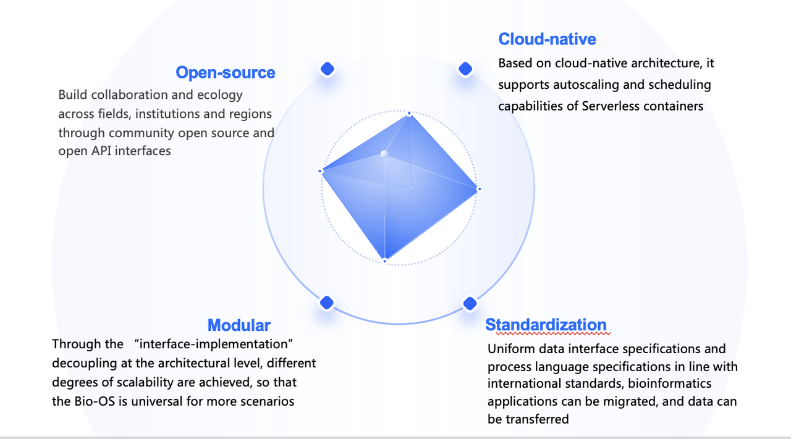
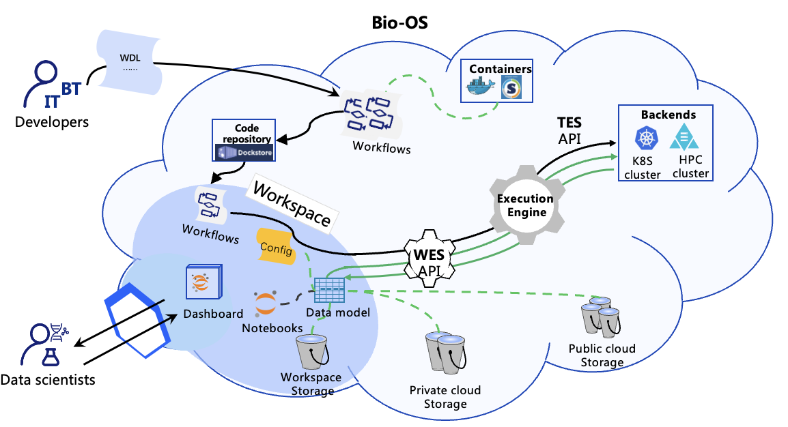
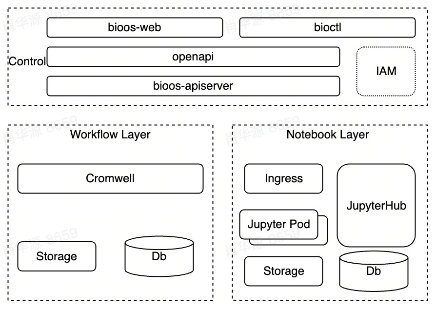

# About Bio-OS
Bio-OS is an open-source platform for genomics users.  It provides a workspace which encapsulates data, workflows, Notebooks, job history, etc. Bio-OS provides both  GUI and CLI(Command Line Interface) to quickly setup and run  workflows specified by languages like WDL and notebook as well.

## Bio-OS Concept

----
## Bio-OS Workspace
Workspace is a complete encapsulation of a bioinformatics research process, including data, environment, code, operational calculation procedures, results, and dashboard as an overview. It is the basic unit that realizes executable, transportable, reproducible, shareable and publishable scientific research and biological application.

----
## Architecture :
In Bio-OS, there are three parts in the architecture. 
### Control layer:
1. Bioos-web: the front-end component of Bio-OS.
2. Bioctl is the command-line component of Bio-OS. Users can access Bio-OS through bioctl.
3. OpenAPI is used to describe, produce, consume, and visualize RESTful web services. It's a specification standard for REST APIs that defines the structure and syntax.
4. Bioos-apiserver: It mainly realizes the management of workspace, workflow (conforming to WES specification), data, etc. The bioos-server will send requests to the clusters of each computing plane to implement the running workflow
5. IAM(not supported in Version 1.0.0): service that helps you securely control user access
### Workflow Layer
1. Cromwell: open-source cromwell version v85
2. Storage : store workflow input ,output data or log
### Notebook Layer
1. JupyterHub:  a multi-user Hub that spawns, manages, and proxies multiple instances of the single-user Jupyter notebook server.
2. Storage : Used to store data from jupyter notebook

 

## Capabilities
There are four core capabilities which support Bio-OS.
- Data Management

  Effectively organize massive scale sample data and easily access public data

- Application Management

  Bring together data、workflow、Notebooks、work engine into Sharable、 Traceable and reproducible Workspace

- Resource Management

  Autoscaling through cloud-native which supports hybrid scheduling of multi-cloud heterogeneous resources

- Interactive Analysis

  Using Built-in Notebook to do tertiary analysis

## Getting Started
### Prerequisites
To run Bio-OS, the following prerequisites must be met:
- A computer with one of the following operating systems:
  - CentOS 7.9 +
  - Ubuntu 22.04 +
- Internet access
- Resource Required

Minimum 8 cpu and 16G memory

## Tutorial
### Bio-OS Installation guide
Please look at the Bio-OS installation guide: https://bio-os.gitbook.io/userguide/bu-shu/getting-set-up

### Bio-OS user guide
Please look at the Bio-OS user guide: https://bio-os.gitbook.io/userguide/

### Bio-OS CLI
Please look at the CLI tutorial: https://bio-os.gitbook.io/userguide/chan-pin-zhi-nan/ming-ling-hang-gong-ju-bioctl

## License
This project is licensed under the Apache-2.0 License.
